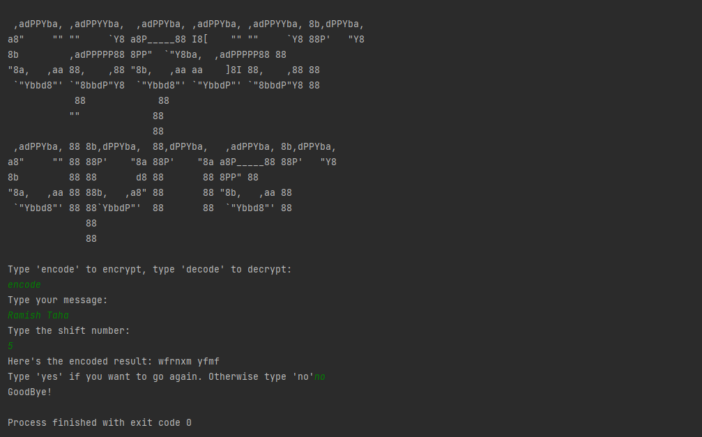

# Caesar Cypher

## A simple program to encode and decode PlainText

###The action of a Caesar cipher is to replace each plaintext letter with a different one a fixed number of places down the alphabet.

## What I learned in this project
1. Better understanding of indexing in Lists.
2. index() method of Strings.
3. Better understanding of conditional statements in for loops.